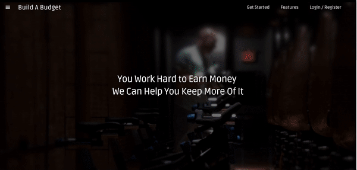
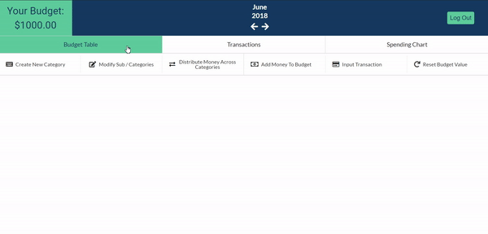
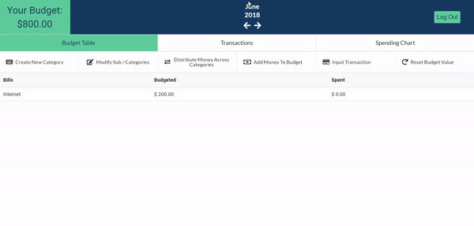

 

# Build A Budget

## Build A Budget is a simple budgeting application that will help you to keep track of your personal finances.

Here is an example of a workflow for Build A Budget. You will add money to the budget first that you would like to keep track of. Next you would create catgories (e.g Bills) and within them sub-categories (e.g Internet) and then allocate some money towards Internet subcategory. Finally once the payment is due, enter the transaction to keep track of how much money you have left budgeted for that subcategory

## Follow these three easy steps to get going

1. Register or Login, then add the money that you would like to budget.

2. Create your own individual budget from a collection of categories and sub-categories.

3. Don't forget to add transactions, and make sure your stay within your budget!

## Live Link

http://build-a-budget.herokuapp.com

**Test Credentials**

* **email:** testuser@test.com
* **password:** test

## Technologies Used

* HTML
* CSS
* JavaScript
* Node
* MongoDB
* Mongoose